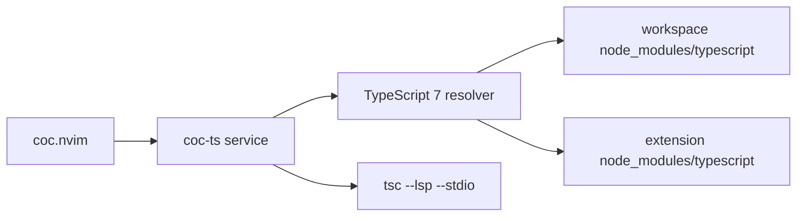

# TypeScript Go coc.nvim Extension Plan

## Overview

Build `coc-ts`, a coc.nvim extension for TypeScript 7+ using the official `typescript` package and `tsc --lsp --stdio`. The extension is separate from `coc-tsserver`, which remains the TypeScript 6 and earlier tsserver-protocol implementation.

## Current Problem Analysis

The repository was empty except for `.git`, so this work starts the extension from scratch. TypeScript 7 exposes a standard LSP server through `tsc --lsp --stdio`, while `coc-tsserver` uses the legacy tsserver protocol and a large custom feature layer. Copying that layer would add compatibility code for an older protocol that `coc-ts` does not need.

TypeScript 7 is now officially published as `typescript`, so preview package and legacy command lookup are no longer valid paths for this extension.

The product and repository name is `coc-ts`. The npm package is published as `@fannheyward/coc-ts` to avoid unscoped package-name similarity restrictions; the Go implementation remains an internal TypeScript detail.

## Call Chain / Architecture Diagram

## Strategy and Approach

Use coc.nvim's built-in `LanguageClient` and register a thin `IServiceProvider` wrapper. The wrapper resolves the active TypeScript 7 executable, starts it over stdio with `--lsp --stdio`, and recreates the client on restart so changes to `ts.tsdk` take effect.

Important implementation choices:

- Pass `--stdio` explicitly. TypeScript 7 exits with `only stdio is supported` when started with `--lsp` alone.
- Resolve executables in this order: configured `ts.tsdk`, workspace `node_modules/typescript`, then extension dependency `typescript`.
- Reject TypeScript packages older than 7. Do not resolve preview packages or legacy commands from `PATH`.
- Prefer the platform binary from `@typescript/typescript-<platform>-<arch>/lib/tsc`; use the package `bin.tsc` wrapper only as a fallback.
- Match coc-tsserver's common TypeScript/JavaScript filetype aliases (`typescript.tsx`, `typescript.jsx`, `javascript.jsx`) and normalize them before sending `didOpen` to the server.
- Keep custom features small: standard LSP covers completion, hover, diagnostics, code actions, formatting, rename, references, semantic tokens, and inlay hints through coc.nvim.
- Support TypeScript native extension custom requests only where useful and cheap: source definition, code lens location display, and API session initialization.
- Reuse coc.nvim's native code action pipeline for import commands instead of sending duplicate LSP requests from coc-ts.

## Implementation Steps

- ✅ Scaffold npm package, TypeScript config, build config, README, and ignore file.
- ✅ Implement TypeScript 7 executable discovery.
- ✅ Implement JS/TS configuration merge middleware for `workspace/configuration`.
- ✅ Implement the coc service wrapper and LSP client creation.
- ✅ Register user commands and extension API.
- ✅ Register sort imports and remove unused imports commands.
- ✅ Install dependencies and run build/typecheck.
- ✅ Replace esbuild with Rolldown and add oxlint/oxfmt checks.

## Risk Assessment

- The resolver intentionally only accepts TypeScript 7+ packages. Users on TypeScript 6 and older should use `coc-tsserver`.
- Some VS Code native-extension custom UI features are intentionally omitted because coc.nvim already handles standard LSP features and does not share VS Code UI APIs.
- Runtime verification needs an installed TypeScript 7 package and coc.nvim host; local verification will cover TypeScript build output and the `tsc` executable.

## Success Criteria

- `npm run typecheck` passes.
- `npm run build` emits `lib/index.js`.
- `npm run lint` and `npm run format:check` pass.
- The extension registers for JavaScript and TypeScript filetypes.
- Starting the service launches `tsc --lsp --stdio`.
- `:CocCommand ts.restart`, `ts.goToSourceDefinition`, `ts.sortImports`, and `ts.removeUnusedImports` are registered.

## Progress Tracking

- ✅ Repository analysis complete.
- ✅ Reference implementation review complete.
- ✅ Project scaffold created.
- ✅ `coc.nvim` dev dependency pinned to `0.0.83-next.24` from the npm `next` dist-tag.
- ✅ `npm run typecheck` passed.
- ✅ `npm run build` passed.
- ✅ `npm pack --dry-run` passed.
- ✅ Remove preview package support and require `typescript@7+`.
- ✅ `node_modules/.bin/tsc --version` reports TypeScript 7.0.2.
- ✅ TS7-compatible `tsconfig.json` update verified by `npm run typecheck`.
- ✅ Fix TS7 LSP transport by launching `tsc --lsp --stdio`.
- ✅ Raw LSP initialize smoke test passed with stderr empty.
- ✅ `ts.sortImports` and `ts.removeUnusedImports` reuse `editor.action.executeCodeActions`.
- ✅ Public configuration and command prefixes use `ts.*`.
- ✅ Removed the profiling directory startup option.
- ✅ Removed the dedicated output command; use coc.nvim's shared output UI instead.
- ✅ Removed the dedicated version command; startup logs include the resolved TypeScript version.
- ✅ Kept `coc-ts` as the product name and scoped the npm package as `@fannheyward/coc-ts`.
- ✅ Replaced esbuild with Rolldown and added oxlint/oxfmt scripts.

## Related Files

- `package.json`
- `package-lock.json`
- `tsconfig.json`
- `rolldown.config.mjs`
- `.oxfmtrc.json`
- `.gitignore`
- `README.md`
- `src/index.ts`
- `src/client.ts`
- `src/configuration.ts`
- `src/typescript.ts`
- `docs/plan/typescript-go-extension-plan.md`
